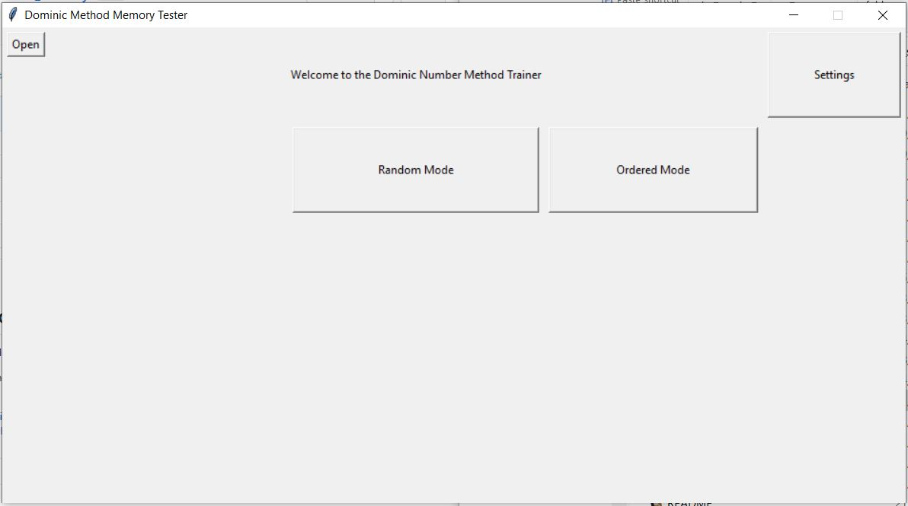

# Dominic method number system

- Application can be downloaded in release. First version, bugs at the moment.

- Dominic system is a memory technique used to memorize long sequence of numbers.

## How to use
- Please download the data_template.csv file and fill in your personal person and action data.
- Download the latest installer from releases
- Open the data_template.csv file using the "Open" button.
- Pick if you want to train using random or ordered method
- You can also pick the range you want to go over by changing it in the settings menu

Reference for the memory technique: https://artofmemory.com/wiki/Dominic_System#:~:text=The%20Dominic%20system%20is%20a%20system%20for%20memorizing%20long%20sequences,to%20remember%20people%20and%20actions.

